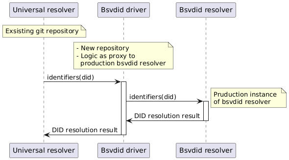

# Universal Resolver Driver: DID BSV

This is a [Universal Resolver](https://github.com/decentralized-identity/universal-resolver/) driver for **did:bsv** identifiers.

# Basic Diagram of usage


## Specifications

* [DID BSV Method Specification](https://bsvblockchain.org/did-method-specification)

## Example DIDs
* Valid did = did:bsv:adaf8c37db395b05bde08ddfb47eb898108dcdef8cf8dac3d9d1bc587d57828e
* Valid did = did:bsv:49e48f452457524f036a3f386388500a6256a9fd21e0e003295bbf3a0455baab
* Deactivated did = did:bsv:9b7cfb6dd65dea457323579798c1479cbd9d00304c1384d590ff15559e6519cf

## Build and Run (Docker)

1. Build the Docker image:
```bash
docker build -f docker/Dockerfile.jvm -t bsvdid-driver .

docker run --network did-network \
  -p 9115:9115 \
  -e BSV_RESOLVER_URL="http://host.docker.internal:9111/" \
  -e QUARKUS_LOG_CONSOLE_JSON="true" \
  -e QUARKUS_LOG_LEVEL="INFO" \
  -e QUARKUS_LOG_CATEGORY__ORG_BSV__LEVEL="DEBUG" \
  --name bsvdid-driver \
  bsvdid-driver

curl -X GET http://localhost:9115/1.0/identifiers/did:bsv:address:1A1zP1eP5QGefi2DMPTfTL5SLmv7DivfNa
```  

## Driver Environment Variables
The driver recognizes the following environment variables:

### `bsv_resolver_url`
* Specifies path to bsv resolver.
* Default value: https://bsvdid-universal-resolver.nchain.systems
