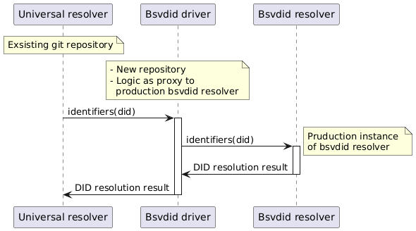

# Universal Resolver Driver: DID BSV 
[Universal Resolver](https://github.com/decentralized-identity/universal-resolver/) Introduction - W3C Submission
We are pleased to introduce our Universal Resolver, a standards-compliant solution for DID resolution based on the [our method](https://docs.teranode.group/tng-identity-documentation/did/bsv-did-method-specifications). This implementation offers a clean, modular, and scalable backend service to the BSV method Universal Resolver Driver.
Our documentation, which explains how the  Universal Resolver works and how to connect to it, can be found at the following link: https://docs.teranode.group/tng-identity-documentation/did/bsv-did-universal-resolver.
This implementation is designed to facilitate seamless interoperability while maintaining a high level of scalability and compliance with W3C’s decentralized identity standards.

# Basic Diagram of usage


## Example DIDs
* Valid did = did:bsv:adaf8c37db395b05bde08ddfb47eb898108dcdef8cf8dac3d9d1bc587d57828e
* Valid did = did:bsv:49e48f452457524f036a3f386388500a6256a9fd21e0e003295bbf3a0455baab
* Deactivated did = did:bsv:9b7cfb6dd65dea457323579798c1479cbd9d00304c1384d590ff15559e6519cf

## Build and Run (Docker)

1. #### Build the Docker image:
```bash
docker build -f docker/Dockerfile.jvm -t bsvdid-driver .
```  
2. #### Run the docker image:
```bash
docker run -p 9115:9115 --name bsvdid-driver bsvdid-driver

curl -X GET http://localhost:9115/1.0/identifiers/did:bsv:49e48f452457524f036a3f386388500a6256a9fd21e0e003295bbf3a0455baab
```  

3. #### Possible configuration of environment  variables:
* **BSV_RESOLVER URL**: Link to the BSVDID universal resolver. Here you can add something like http://localhost:9115/ if you are running bsvdid resolver locally. Default value = https://bsvdid-universal-resolver.nchain.systems 
* **QUARKUS_LOG_CONSOLE_JSON**: Default value = true
* **QUARKUS_LOG_LEVEL**: Default value = INFO

4. #### Run the docker image with configuration:
```bash
docker run \
  -p 9115:9115 \
  -e BSV_RESOLVER_URL="https://bsvdid-universal-resolver.nchain.systems" \
  -e QUARKUS_LOG_CONSOLE_JSON="true" \
  -e QUARKUS_LOG_LEVEL="INFO" \
  -e QUARKUS_LOG_CATEGORY__ORG_BSV__LEVEL="DEBUG" \
  --name bsvdid-driver \
  bsvdid-driver

curl -X GET http://localhost:9115/1.0/identifiers/did:bsv:49e48f452457524f036a3f386388500a6256a9fd21e0e003295bbf3a0455baab
```  

## Authors
* Goran Stevanić (g.stevanic@teranode.group)
* David Bricman (d.bricman@teranode.group)
* Marko Kramer (m.kramer@teranode.group)
* Maria Eugenia Lopez (h.lopez@teranode.group)
